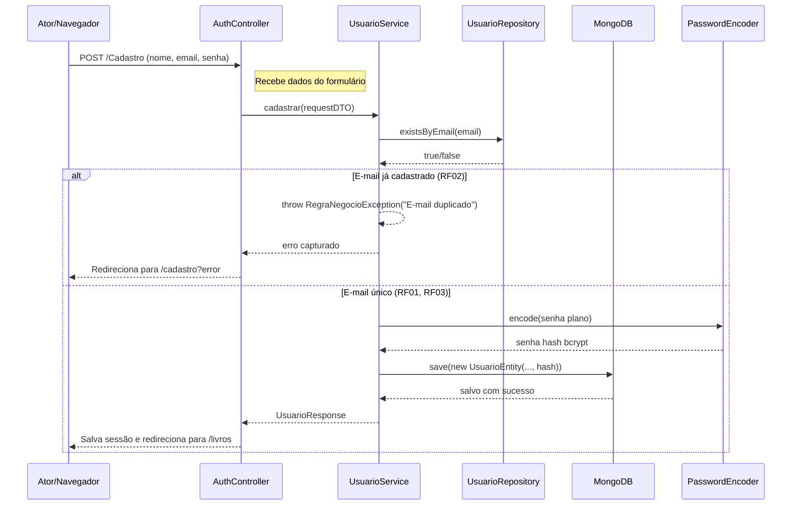
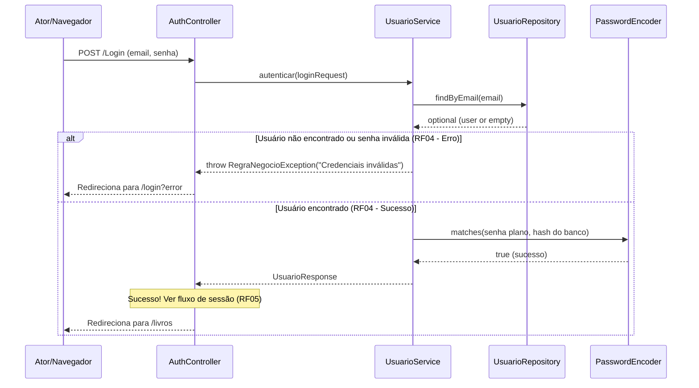
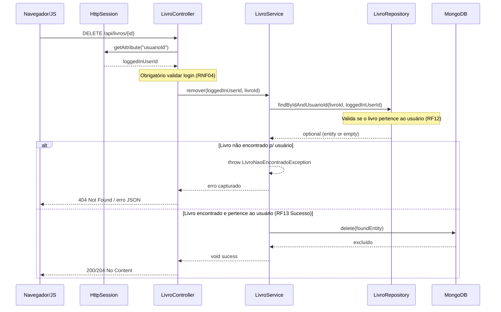
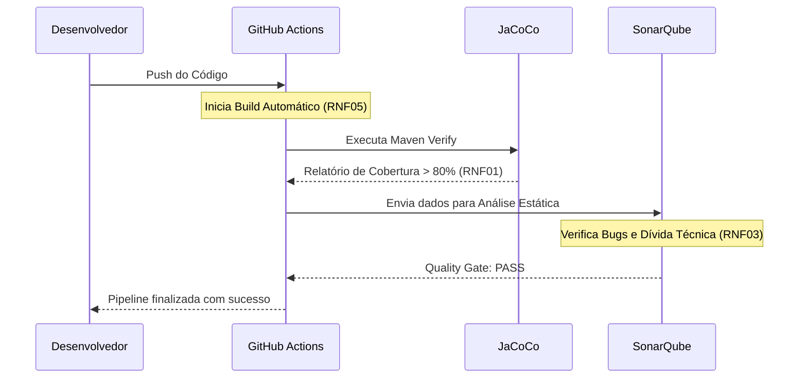
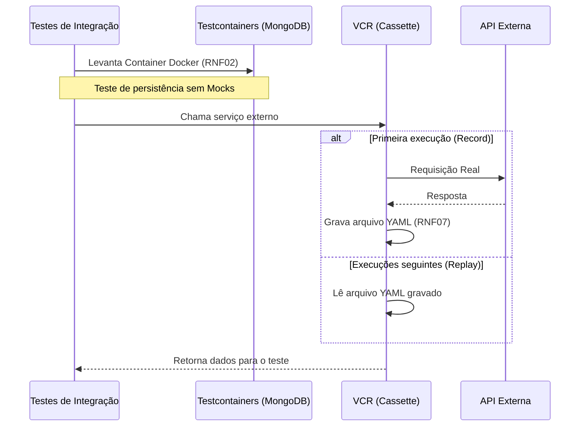
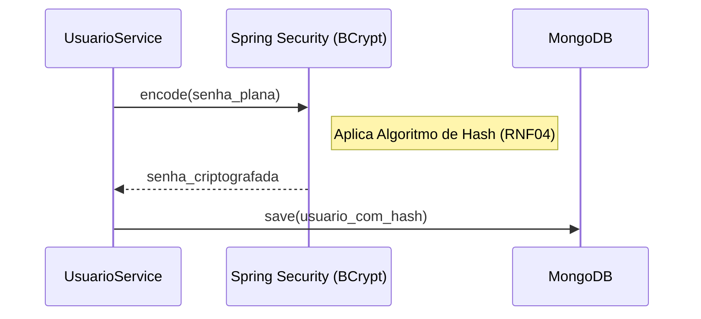
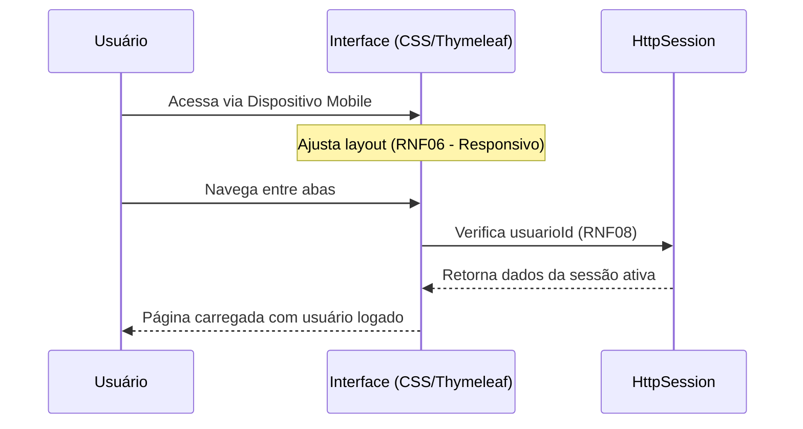

## DIAGRAMAS UML DE SEQUÊNCIA
#REQUISITOS FUNCIONAIS

**RF01/RF02/RF03**

<br>

**RF04**

<br>

**RF05**
```mermaid
sequenceDiagram
    participant C as AuthController
    participant S as UsuarioService
    participant Session as HttpSession

    Note over C: Pós-validação de credenciais (RF04)
    C->>S: autenticar(...)
    S-->>C: UsuarioResponse (contém ID, email)
    C->>Session: setAttribute("usuarioId", userRes.id)
    C->>Session: setAttribute("usuarioEmail", userRes.email)
    C-->>C: Redirect to /livros
 ```
<br>

**RF06**
```mermaid
sequenceDiagram
    participant User as Ator
    participant C as AuthController
    participant Session as HttpSession

    User->>C: POST /Logout
    C->>Session: invalidate()
    Note right of Session: Sessão é destruída
    C-->>User: Redirect to /login
```
<br>

**RF07/RF0/RF09/RF10**
```mermaid
sequenceDiagram
    participant User as Navegador/JS
    participant Session as HttpSession
    participant C as LivroController
    participant S as LivroService
    participant R as LivroRepository
    participant DB as MongoDB

    User->>C: POST /api/livros (JSON: tít, aut, isbn, ano)
    C->>Session: getAttribute("usuarioId")
    Session-->>C: loggedInUserId

    alt Usuário não logado (RNF04 - Segurança)
        C-->>User: 401 Unauthorized
    else Usuário logado (RF07)
        C->>S: criar(loggedInUserId, requestDTO)

        alt Título/Autor/ISBN vazios (RF08)
            S-->>C: throw RegraNegocioException
            C-->>User: 400 Bad Request / erro JSON
        else Ano futuro ou <= 0 (RF09)
            S-->>C: throw RegraNegocioException
            C-->>User: 400 Bad Request / erro JSON
        else
            S->>R: existsByIsbnAndUsuarioId(isbn, userId)
            R-->>S: true/false
            alt ISBN duplicado p/ usuário (RF10)
                S-->>C: throw RegraNegocioException
                C-->>User: 400 Bad Request / erro JSON
            else Validação sucesso
                S->>DB: save(new LivroEntity(..., userId))
                DB-->>S: salvo
                S-->>C: LivroResponse
                C-->>User: 201 Created com JSON
            end
        end
    end
 ```
<br>

**RF11**
```mermaid
sequenceDiagram
    participant User as Navegador/JS
    participant Session as HttpSession
    participant C as LivroController
    participant S as LivroService
    participant R as LivroRepository

    User->>C: GET /api/livros
    C->>Session: getAttribute("usuarioId")
    Session-->>C: loggedInUserId

    Note over C: Obrigatório validar login (RNF04)
    C->>S: listarPorUsuario(loggedInUserId)
    S->>R: findByUsuarioId(loggedInUserId)
    Note over R: Filtro é feito aqui (RF11)
    R-->>S: List<LivroEntity>
    S-->>C: List<LivroResponseDTO>
    C-->>User: 200 OK com Lista JSON
```
<br>

**RF12/RF13**

<br>

#REQUISITOS NÃO FUNCIONAIS
**RNF01/RNF03/RNF05**


<br>

**RNF02/RNF07**

<br>

**RNF04**

<br>

**RNF06/RNF08**

